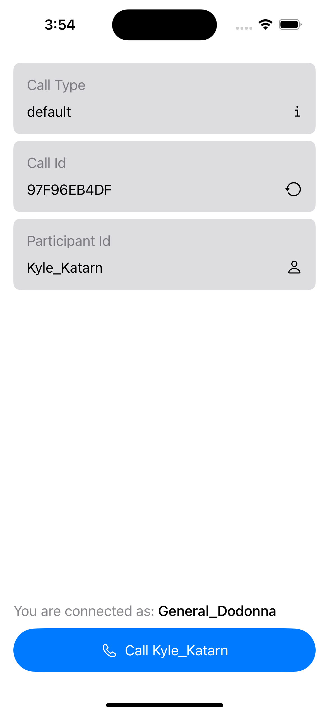

# RingingFlow Sample App

## Description 

The application in this repository is demonstrating the approach on handling a ringing flow in your video/audio application that uses StreamVideo SDK. It can be used as a template or a guide for your app. 

Below we are going to discuss about the configuration that's required to run it. We will also highlight the important bits which you can go through and see if you need to apply them in your application.

## Configuration

In order to test the ringing flow we are going to need 2 things: 1. a StreamVideo API key, 2. two users that will be calling each other. You can read more about getting the required key and tokens [here](https://getstream.io/video/docs/ios/guides/client-auth/).

Once you have them we will need to open the `RingingFlow/Configuration.swift` file and update the values in there. You will notice, that the `Configuration` is being setup to support 2 different users that one of them runs on the Simulator (and will be used to call the other user) and the other user runs on a physical device. 
> **_NOTE:_**  Remember, in order to test the ringing flow you need 2 users with a different user_id where at least one of them runs the app on a physical device. This is required because VoIP push notification cannot be delivered on simulators. You also need to ensure that the app bundle identifier you are using matches the bundle identifier that you have configured in the Stream Dashboard to receive VoIP push notifications.

Once you have updated the `Configuration.swift` file you can run the app on the simulator and the physical device. You should be presented with a UI looking like this 

All fields have been prefilled for you but you can change any of them to match your needs and application's setup.

Before pressing the call button, cross check that both the simulator and the device are connected as the right user and tha the simulator is set to call the user on the physical device.

The sample app extends and demonstrates the following use cases:
- Audio-only call
- Text change on the outgoing call once callee's device is connected (but not joined the call yet).
- Call again: The caller will be prompted to call again once the previous call ends.
- Callee is busy: If the callee is busy when the caller calls them, the callee will immediately reject the call and the caller will be presented with a screen, informing them that the callee was busy.

## Implementation

Now, let's go through the code and the bits that you will need to pay attention and make sure that your app implements.

This sample app is using the components that the StreamVideoSDK ships with. That allow us to easily handle CallKit integration (by using the CallKit related objects) and state management (by using the CallViewModel).

Let's take the use cases we mentioned above and analyze the code that it's required for each of them:

### Audio-only call

As we are using the provided `CallViewModel` we can easily set the call to be audio-only by providing the right `CallSettings` like we do in `RingingFlowApp.swift`

```swift
@StateObject private var callViewModel = CallViewModel(
    callSettings: .init(
        audioOn: true,
        videoOn: false,
        speakerOn: false
    )
)
```

### Text change on the outgoing call once callee's device is connected

In order to support this one, we need a way to inform the caller's device that callee has been connected. Given that the callee's app may not be running, we are going to rely and update our `CallKit` integration code, to send a custom event every time an incoming call is being received.

Firstly we are going to define our custom event somewhere where we can easily reference it:

```swift
enum CustomEvent: String {
    case isAlive = "v=fNFzfwLM72c"
}
```

The main object that we care about from CallKit is `CallKitService`, which we are subclassing and extending as follow:

```swift
final class CustomCallKitService: CallKitService {

    private var ringingCallObservationCancellable: AnyCancellable?

    override func didUpdate(_ streamVideo: StreamVideo?) {
        super.didUpdate(streamVideo)
        ringingCallObservationCancellable?.cancel()

        guard let streamVideo else {
            return
        }

        ringingCallObservationCancellable = streamVideo
            .state
            .$ringingCall
            .removeDuplicates { $0?.cId == $1?.cId }
            .sink { ringingCall in
                Task { @MainActor [weak self] in
                    self?.didUpdateRingingCall(ringingCall)
                }
            }
    }

    // MARK: - Private helpers

    @MainActor
    private func didUpdateRingingCall(_ ringingCall: Call?) {
        guard let streamVideo else {
            return
        }
        guard 
            let ringingCall,
            ringingCall.state.createdBy?.id != streamVideo.user.id
        else {
            return
        }

        guard streamVideo.state.activeCall == nil else {
            return
        }

        Task {
            do {
                try await ringingCall.sendCustomEvent([
                    CustomEvent.isAlive.rawValue: .bool(true)
                ])
                log.debug("\(streamVideo.user.id) isAlive in call:\(ringingCall.cId)")
            } catch {
                log.error(error)
            }
        }
    }
}
```

With the `CustomCallKitService` implemented we can go ahead and inject it in StreamVideo. We need to do that as soon as our app is active. For that reason we using the `AppDelegate`:

```swift
final class AppDelegate: NSObject, UIApplicationDelegate {

    func application(
        _ application: UIApplication,
        didFinishLaunchingWithOptions launchOptions: [UIApplication.LaunchOptionsKey : Any]? = nil
    ) -> Bool {
        InjectedValues[\.callKitService] = CustomCallKitService()
        return true
    }
}
```

We are not setup to send the the `isAlive` event. We only need to setup our code to react on it. We can easily do that by following the [events guide](https://getstream.io/video/docs/ios/advanced/events/) from our docs. Our outgoing call view is the `CustomOutgoingCallView.swift` where we can see the code below:

```swift
.task {
    guard let call = viewModel.call else {
        return
    }
    log.debug("Observing isAlive customVideoEvent.")
    for await event in call.subscribe(for: CustomVideoEvent.self) {
        guard
            event.custom[CustomEvent.isAlive.rawValue] != nil
        else {
            return
        }
        Task { @MainActor in
            isRinging = true
        }
    }
}
```

### Call again: The caller will be prompted to call again once the previous call ends.

With the release of [1.0.0](https://github.com/GetStream/stream-video-swift/releases/tag/1.0.0) the StreamVideo SDK ships with a [ViewModifier that can be used to present custom UI to the user, once their call has ended](https://getstream.io/video/docs/ios/ui-cookbook/call-quality-rating/). We are going to use it to present our `CallAgainView.swift`. 

To do that, we update the `ContentView.swift` with the following code:

```swift
.onCallEnded(presentationValidator: { $0?.state.createdBy?.id == streamVideo.user.id }) { call, dismiss in
    if let call {
        CallAgainView(
            callViewModel: callViewModel,
            call: call,
            userWasBusy: userWasBusy,
            dismiss: {
                userWasBusy = false
                presentUserWasBusy = false
                lastCall = nil
                dismiss()
            }
        )
    }
}
```

### Callee is busy

Handling the busy use case, we are going to reuse most of the stuff we did for the isAlive case. 

First we are going to update the CustomEvent to contain a new one that represents the `isBusy` event:

```swift
enum CustomEvent: String {
    case isAlive = "v=fNFzfwLM72c"
    case isBusy = "v=weoiyha213781"
}
```

Then we will update our `CustomCallKitService.swift:didUpdateRingingCall` as follows:

```swift
@MainActor
private func didUpdateRingingCall(_ ringingCall: Call?) {
    guard let streamVideo else {
        return
    }
    guard 
        let ringingCall,
        ringingCall.state.createdBy?.id != streamVideo.user.id
    else {
        return
    }

    guard streamVideo.state.activeCall == nil else {
        Task {
            do {
                try await ringingCall.sendCustomEvent([
                    CustomEvent.isBusy.rawValue: .bool(true)
                ])
                log.debug("\(streamVideo.user.id) isBusy in call:\(ringingCall.cId)")
                try await ringingCall.reject()
                log.debug("\(streamVideo.user.id) rejected call:\(ringingCall.cId)")
            } catch {
                log.error(error)
            }
        }
        return
    }

    Task {
        do {
            try await ringingCall.sendCustomEvent([
                CustomEvent.isAlive.rawValue: .bool(true)
            ])
            log.debug("\(streamVideo.user.id) isAlive in call:\(ringingCall.cId)")
        } catch {
            log.error(error)
        }
    }
}
```

Here we can see  that there is a new code-path that sends our new custom event and then rejects the call.

Finally we will go and update our `ContentView.swift:body` with the following:

```swift
.onReceive(callViewModel.$call) { call in
    if let call {
        userWasBusy = false
        lastCall = call
        isBusyEventObservationTask = Task {
            for await event in call.subscribe(for: CustomVideoEvent.self) {
                guard
                    event.custom[CustomEvent.isBusy.rawValue] != nil
                else {
                    return
                }
                Task { @MainActor in
                    userWasBusy = true
                }

            }
        }
    } else if call == nil, userWasBusy {
        presentUserWasBusy = true
        isBusyEventObservationTask = nil
    }
}
.sheet(isPresented: $presentUserWasBusy) {
    if let lastCall {
        CallAgainView(
            callViewModel: callViewModel,
            call: lastCall,
            userWasBusy: true,
            dismiss: {
                userWasBusy = false
                presentUserWasBusy = false
                self.lastCall = nil
            }
        )
    }
}
```

## Important bits

In order to synchronize the CallViewModel with the CallKit integration we need to add the following code in our `ContentView.swift`

```swift
.onReceive(streamVideo.state.$activeCall, perform: { activeCall in
    callViewModel.setActiveCall(activeCall)
})
```